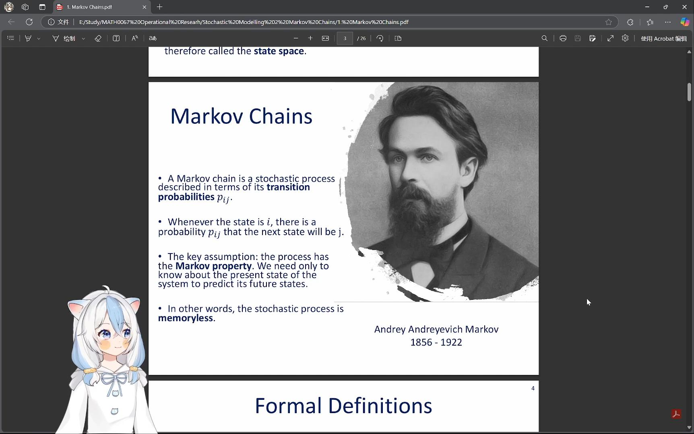

# Live2D-LLM-Chat
[US English](README.md) | [CN 中文](README_CN.md)

[](https://github.com/FunAudioLLM/SenseVoice)
[](https://openai.com/api/) 
[](https://github.com/FunAudioLLM/CosyVoice)
[](https://github.com/Arkueid/live2d-py)

[](https://www.python.org/downloads/)
[](https://www.anaconda.com/docs/getting-started/anaconda/install)

> **Live2D + ASR + LLM + TTS** → Real-time voice interaction | Local deployment / Cloud inference

---
## ✨ 1. Project Introduction

**Live2D-LLM-Chat** is a real-time AI interaction project that integrates **Live2D virtual avatars**, **Automatic Speech Recognition (ASR)**, **Large Language Models (LLM)**, and **Text-to-Speech (TTS)**. It allows a **virtual character** to recognize the user's speech through ASR, generate intelligent responses using AI, synthesize speech via TTS, and drive Live2D animations with lip-sync for a natural interaction experience.

---
### 📌 1.1. Main Features
- 🎙 **Automatic Speech Recognition（ASR）**: Uses FunASR for Speech-to-Text (STT) processing.
- 🧠 **Large Language Model（LLM）**: Supports rational conversation using OpenAI GPT / DeepSeek.
- 🔊 **Text-to-Speech（TTS）**: Uses CosyVoice for high-quality speech synthesis.
- 🏆 **Live2D Virtual Character Interaction**: Renders models using Live2D SDK and enables real-time feedback.

---
### 📌 1.2. Enhanced Features
- **LLM module** supports both local and cloud deployment. The local deployment is based on **LM Studio**, which covers all open-source models, but personal device performance may limit large - models. Cloud deployment supports **OpenAI** and **DeepSeek** APIs.
- Stores conversation history with **context memory**. Every five conversations, a summary is generated to prevent excessive text accumulation.
- **Conversation logging** records the timestamp and dialogue history, including **TTS audio outputs**, making it easy to review past interactions. This feature can be disabled in the config file to **reduce memory usage**.
- Enhanced Live2D **eye-tracking** and **blinking logic** to provide natural blinking even if the Live2D model lacks built-in logic. Implements **lip-sync mechanics** by analyzing real-time audio volume from the TTS output.
- Modifies CosyVoice API to **directly save** generated speech files and **merge** segmented audio for long text synthesis.


#### 🎬 Interaction Demo

| Voice Input	 | AI Processing | Live2D Output |
|----------|---------|------------|
| 🎤 You: Hello! | 🤖 AI: Hi there! | 🧑‍🎤 "Hi there!" (Lip sync) |
| 🎤 You: How's the weather? | 🤖 AI: It's a sunny day! | 🧑‍🎤 "It's a sunny day!" (Speech tone variation) |

---
### 📌 1.3. Tech Stack
| Component  | Technology  |
|-------|-------|
| ASR (Automatic Speech Recognition) | SenseVoice |
| LLM (Large Language Model) | OpenAI GPT / DeepSeek |
| TTS (Text-to-Speech) | CosyVoice |
| Live2D Animation | live2d-py + OpenGL |
| Configuration Management | Python Config |

---
## 🛠 2. Installation and Configuration

---

### 📌 2.1. System Requirements

This project is developed with **Python 3.11**, and the following system requirements should be met before running it:

✅ **Operating System**:
   - 🖥 **Windows 10/11** or **Linux**

✅ **Python Version**:
   - 📌 Recommended **Python 3.8 or above**

⚠️ **Note**:  
The **TTS module** runs in a **conda environment** and requires **Miniconda** to be installed beforehand.  
🔗 You can download it from [Miniconda Official Website](https://docs.conda.io/en/latest/miniconda.html).
---

### 📌 2.2. Dependencies

This project leverages the following open-source libraries and models: 

🎙 **Automatic Speech Recognition (ASR)**:
- **SenseVoice** - High-precision **multilingual speech recognition** and **speech emotion analysis**.
- 🔗 **GitHub**: [SenseVoice Repository](https://github.com/FunAudioLLM/SenseVoice)

🔊 **Text-to-Speech (TTS)**:
- **CosyVoice** - A powerful **generative speech synthesis system**, supporting **zero-shot voice cloning**.
- 🔗 **GitHub**: [CosyVoice Repository](https://github.com/FunAudioLLM/CosyVoice)

📽 **Live2D Animation**:
- **live2d-py** - A tool for **directly loading and manipulating Live2D models** in Python.
- 🔗 **GitHub**: [live2d-py Repository](https://github.com/Arkueid/live2d-py)

---
## 📁 3. Installation Steps

---
### 📌 3.1. Clone the Project Repository

```bash
git clone https://github.com/suzuran0y/Live2D-LLM-Chat.git
cd Live2D-LLM-Chat
```

### 📌 3.2. Create a Virtual Environment (Optional)
```bash
python -m venv venv
source venv/bin/activate  # Linux/macOS activation
venv\Scripts\activate  # Windows activation
```

### 📌 3.3. Install Dependencies

```bash
pip install -r requirements.txt
```

---
### 📌 3.4. Install ASR & TTS Models

🎙 **Speech Recognition (ASR) - SenseVoice**
This project uses SenseVoice for ASR, supporting **high-precision multilingual speech recognition** and **speech emotion detection**.

#### 1️⃣ Install SenseVoice Dependencies
Install SenseVoice dependencies using pip:
```bash
pip install funasr
```

If you need ONNX or TorchScript inference, install the corresponding versions:
```bash
pip install funasr-onnx  # ONNX version
pip install funasr-torch  # TorchScript version
```

#### 2️⃣ Download SenseVoice Pre-trained Models
SenseVoice provides several **pre-trained models**, which can be downloaded via ModelScope:
```python
from modelscope import snapshot_download

# Download SenseVoice-Small version
snapshot_download('iic/SenseVoiceSmall', local_dir='pretrained_models/SenseVoiceSmall')
# Download SenseVoice-Large version for higher accuracy
snapshot_download('iic/SenseVoiceLarge', local_dir='pretrained_models/SenseVoiceLarge')
```

🔗 More details: [SenseVoice GitHub](https://github.com/FunAudioLLM/SenseVoice) | [ModelScope](https://www.modelscope.cn/models/iic/SenseVoiceSmall)

🔊 **Text-to-Speech (TTS) - CosyVoice**
This project uses CosyVoice for TTS, supporting **multilingual speech synthesis, voice cloning, and cross-lingual synthesis**.

#### 1️⃣ Install CosyVoice Dependencies
Clone the CosyVoice repository:
```bash
git clone --recursive https://github.com/FunAudioLLM/CosyVoice.git
cd CosyVoice
git submodule update --init --recursive
```

#### 2️⃣ Create a Conda Environment and Install Dependencies
```bash
# Create a Conda virtual environment
conda create -n cosyvoice -y python=3.10
conda activate cosyvoice

# Install required dependencies
conda install -y -c conda-forge pynini==2.1.5
pip install -r requirements.txt -i https://mirrors.aliyun.com/pypi/simple/ --trusted-host=mirrors.aliyun.com
```

Install SoX (if necessary):
```bash
# Ubuntu
sudo apt-get install sox libsox-dev
# CentOS
sudo yum install sox sox-devel
```

#### 3️⃣ Download CosyVoice Pre-trained Models
It is recommended to download the following CosyVoice pre-trained models:
```python
from modelscope import snapshot_download

snapshot_download('iic/CosyVoice2-0.5B', local_dir='pretrained_models/CosyVoice2-0.5B')
snapshot_download('iic/CosyVoice-300M', local_dir='pretrained_models/CosyVoice-300M')
snapshot_download('iic/CosyVoice-300M-SFT', local_dir='pretrained_models/CosyVoice-300M-SFT')
snapshot_download('iic/CosyVoice-300M-Instruct', local_dir='pretrained_models/CosyVoice-300M-Instruct')
snapshot_download('iic/CosyVoice-ttsfrd', local_dir='pretrained_models/CosyVoice-ttsfrd')
```

🔗 More details: [CosyVoice GitHub](https://github.com/FunAudioLLM/CosyVoice) | [ModelScope](https://www.modelscope.cn/iic/CosyVoice2-0.5B)

---
## ⚙️ 4. Configuration for Local Setup（important！！）

---

### 📌 4.1. Configure ASR & TTS Models

After installing **ASR** and **TTS** models, follow these steps for local configuration:

✅ **Replace SenseVoice Directory** 
- Move the downloaded **SenseVoice** folder into `Live2D-LLM-Chat/ASR_env/`, replacing the existing empty folder.

✅ **Replace CosyVoice Directory**
- Move the downloaded **CosyVoice** folder into `Live2D-LLM-Chat/TTS_env/`, replacing the existing empty folder.

✅ **Replace `webui.py` File**
- Move the `TTS_env/webui.py` file into the `CosyVoice` folder, replacing the original `webui.py` file.

---

### 📌 4.2. Configure `config.py` for Local Environment
Modify **`config.py`** to adjust local file paths and parameters. Example:
```python
class Config:
    # 🏠 Project Root Directory
    PROJECT_ROOT = "E:/PyCharm/project/project1"

    # 🎙 ASR (Automatic Speech Recognition) Configuration
    ASR_MODEL_DIR = os.path.join(PROJECT_ROOT, "ASR_env/SenseVoice/models/SenseVoiceSmall")
    ASR_AUDIO_INPUT = os.path.join(PROJECT_ROOT, "ASR_env/input_voice/voice.wav")

    # 🔊 TTS (Text-to-Speech) Configuration
    TTS_API_URL = "http://localhost:8000/"
    TTS_OUTPUT_DIR = os.path.join(PROJECT_ROOT, "TTS_env/output_voice/")

```
❗ **Ensure all paths are correctly set up before running the project!**

---
## 📌 4.3. Configure LLM Model

Local deployment of the **LLM model** relies on **LM Studio**. Follow these steps:

#### 1️⃣ Install LM Studio
Download from [GitHub](https://github.com/lmstudio-ai) or the [LM Studio official website](https://lmstudio.ai/).

#### 2️⃣ Open the application and download an LLM model compatible with your device.
Start LM Studio and obtain the local API URL.
Adjust the model path & port number in `config.py`.

#### 3️⃣ Run the local LLM and integrate it into the project.
⚠️ **Note**: The performance of locally deployed LLM models depends on device capabilities and may not match cloud-based models. If higher performance is required, consider using OpenAI GPT-4 or DeepSeek API.

---
## 👀 5. Usage Instructions
---

## 📌 5.1. Start the TTS AP
 
Before running the main program, **start the TTS API**:

```bash
python TTS_api.py  # This is now integrated into the main program but can be run separately for debugging.
```

🎯 The TTS API module will run `webui.py` in the **conda environment**. Once successfully started, you can access the WebUI for voice synthesis management: 🌍 Default address: [http://localhost:8000](http://localhost:8000)

❗ Ensure the **TTS API is running properly**, or the program will not be able to generate speech.

---
### 📌 5.2. Run the Main Program

Once the TTS API is started, run the main program:

```bash
python main.py
```

🎙 **Interaction Steps**:

1️⃣ **Press and hold the Ctrl key** to start recording, **press the Alt key** to stop recording. The voice will be automatically converted into text.
2️⃣ The **text is processed by the LLM module**, generating a response.
3️⃣ The **response text is converted into speech** via the TTS module, and the Live2D model will sync its lip movements to the speech.

---

### 📌 5.3. System Architecture Diagram

| **Step** | **Module** | **Input** | **Processing** | **Output** |
|----------|---------|---------|---------|---------|
| 🎤 **User Speech** | **User** | Speech Input | User speaks | Audio Signal |
| 🎙 **Speech Recognition** | **ASR (SenseVoice)** | Audio Signal | Speech-to-Text (STT) | Recognized Text |
| 🤖 **Text Understanding & Generation** | **LLM (GPT-4 / DeepSeek)** | Recognized Text | Semantic Analysis & AI Response Generation | AI-Generated Text |
| 🔊 **Speech Synthesis** | **TTS (CosyVoice)** | AI-Generated Text | Text-to-Speech (TTS) | Speech Data |
| 🎭 **Live2D Animation** | **Live2D** | Speech Data | Motion Generation | Character Animation |
| 🗣 **AI Voice Feedback** | **User** | Character Voice & Actions | User hears AI response | Voice & Visual Interaction |

---
# 📂 6. Project Structure

This project follows a modular design, integrating **ASR (speech recognition), TTS (text-to-speech), LLM (large language model), and Live2D animation rendering** as core functionalities. Below is the **complete project structure**:

```bash
Live2D-LLM-Chat/
│── main.py                # 🚀 Main program entry
│── ASR.py                 # 🎙 Speech Recognition (ASR) module
│── TTS.py                 # 🔊 Speech Synthesis (TTS) module
│── TTS_api.py             # 🌐 TTS API module
│── LLM.py                 # 🤖 Large Language Model (LLM) module
│── Live2d_animation.py    # 🎭 Live2D animation management module
│── webui.py               # 🖥 WebUI for voice synthesis
│── config.py              # ⚙️ Configuration file
│── requirements.txt       # 📦 Dependency list
└── README.md              # 📄 Project documentation
```
---
## 🚀 7. Future Plans
---

### 📌 7.1. Past Developments

#### 📅 **2025.01.28 - Initial Project Concept** 
- 🎯 **Core Goals Defined**: Developing a **Live2D + LLM** real-time interaction system.
- 🔍 **Technology Research**: Investigating ASR (speech recognition), TTS (text-to-speech), and Live2D solutions.
- ✅ **Core Components Selected**:
  - **SenseVoice** for ASR
  - **CosyVoice** for TTS
  - **live2d-py** for animation rendering

#### 📅 **2025.02.28 - First Version Release**
- 🎙 **Implemented speech input & recognition (ASR)**
- 🤖 **Integrated LLM for text generation**
- 🔊 **Generated speech output & synced Live2D mouth movements**

---

### 📌 7.2. Future Plans ~~(Wishlist)~~

🔹 **LLM Module Optimization**:
   - Due to **device limitations**, local deployment may not match cloud-based models. **Improving LLM processing logic** to enhance stability.

🔹 **Refined Output Management**:
   - Optimizing **program logs and output messages** to retain only essential information for a cleaner display.

🔹 **Enhanced Live2D Interaction**:
   - **Improving Live2D model expressions and movements** to make interactions feel more natural and engaging.

🔹 **Additional Optimizations**:
   - 🛠 Improving TTS & ASR efficiency
   - 🌍 Expanding multilingual support
   - 🔗 Enhancing cloud-based inference capabilities

---
#### 📅 **2025.02.28 - First Version Release**
- 🎙 **Implemented speech input & recognition (ASR)**
- 🤖 **Integrated LLM for text generation**
- 🔊 **Generated speech output & synced Live2D mouth movements**

---
## 🤝 8. Contributions & Acknowledgments
---

This project builds upon work from [SenseVoice](https://github.com/FunAudioLLM/SenseVoice), [CosyVoice](https://github.com/FunAudioLLM/CosyVoice), and [live2d-py](https://github.com/Arkueid/live2d-py), incorporating modifications and optimizations to fit the project’s requirements.  
🎉 **Special thanks to the original developers!**

💡 **We welcome contributions and feedback!**

📢 If you have suggestions or improvements, please submit a **PR (Pull Request)** or **Issue** on GitHub.

---
## 📄 9. License
This project is licensed under the [Apache-2.0 License](LICENSE).